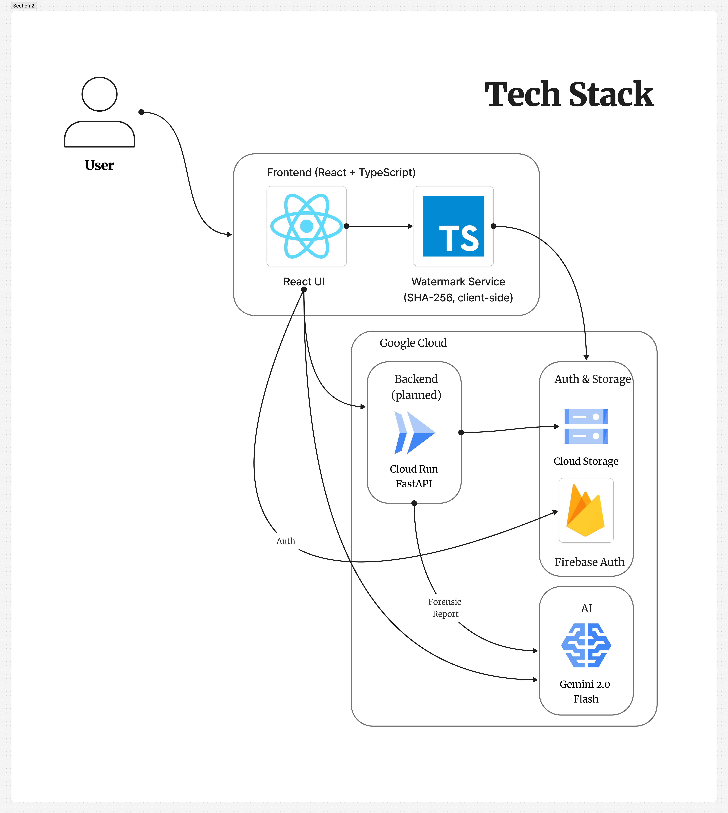

## 🎨 Monet

Monet — AI-Powered Digital Media Forensics

---

## 🔎 What it does

Monet is an AI-powered forensic application that embeds invisible, tamper-evident signatures into digital media to verify authenticity and detect manipulation

As AI-generated content and deepfakes become more advanced, verifying the originality of digital media has become increasingly difficult. Creators risk losing ownership of their work, while manipulated content fuels misinformation and reputational harm

Monet addresses this problem by combining cryptographic hashing with byte-level encoding to detect unauthorized modifications. When tampering is detected, Google Gemini translates raw hash discrepancies into clear, human-readable forensic reports

Monet empowers creators, journalists, and everyday users with a tool that makes digital authenticity both secure and understandable

---

## 💡 Inspiration

This project was inspired by a viral case on X in which a creator named Asami gained a massive following posting what later turned out to be AI-generated “art.” Because much of the content consisted of convincing thirst traps, we found the situation to be both funny and alarming, as many followers had paid for access to media they believed was authentic

---

## 🛠 How we built it

### Tech Stack


### System Flow


Monet is built with a modular architecture separating signature embedding, verification, and AI reasoning layers

- **Cryptographic Layer:** SHA-256 hashing combined with structured byte-level encoding to detect modifications
- **Backend:** Python with FastAPI to handle file processing and verification logic
- **Frontend:** React interface for media upload and report visualization
- **AI Integration:** Google Gemini generates structured forensic explanations from hash comparison results

Security and reliability were prioritized by isolating verification logic from user-facing components and designing clear separation between processing layers

---

## ⚔ Challenges we ran into

- Designing a signature embedding approach that preserves file integrity while remaining tamper-evident
- Preventing exposure of sensitive verification logic
- Translating cryptographic discrepancies into meaningful explanations without AI hallucination
- Managing API constraints while maintaining fast response times
- Working within limited hackathon time to balance security, usability, and AI integration

---

## 🏆 Accomplishments we’re proud of

- Successfully embedding invisible digital signatures without degrading media quality
- Achieving reliable byte-level tamper detection
- Building an AI explanation layer that makes technical verification accessible
- Creating a clean and intuitive user interface under time constraints

---

## 📚 What we learned

We learned how to bridge cryptography and AI in a cohesive system. Technically, we gained experience in modular backend design, API integration, and secure file handling

We also learned the importance of balancing technical rigor with accessibility — security tools must be understandable to be impactful

---

## 🚀 What’s next for Monet

- Support for additional media formats (video, audio, documents)
- Real-time browser extension integration
- Scalable cloud deployment
- Partnerships with creators, journalists, and digital rights organizations.
- Advanced tamper classification using machine learning

## 🎥 Demo Video

[](https://vimeo.com/1168582982)

*Click the image above to watch the full demonstration on Vimeo, or [click here](https://vimeo.com/1168582982?share=copy&fl=sv&fe=ci#t=0).*

## 🔩 Installation

Follow the steps below to run Monet locally.

### 📦 Prerequisites
- Node.js (v16+)
- npm (or yarn)
- Git

---

## 🔩 Installation

### 1) Clone the repository
```bash
git clone https://github.com/Kuail33/monet.git
cd monet
npm install
```

### 2) Set environment variables

Create a file named `.env` in the project root:

```env
GEMINI_API_KEY=your_google_gemini_api_key

# If using Firebase environment variables:
FIREBASE_API_KEY=...
FIREBASE_AUTH_DOMAIN=...
FIREBASE_PROJECT_ID=...
FIREBASE_STORAGE_BUCKET=...
FIREBASE_MESSAGING_SENDER_ID=...
FIREBASE_APP_ID=...
```

### 3) Run the development server
```bash
npm run dev
```

The application will be available at:

```
http://localhost:3000
```
